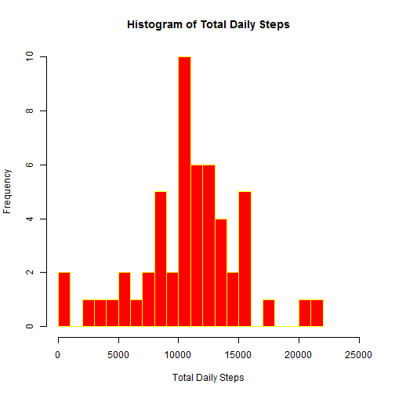
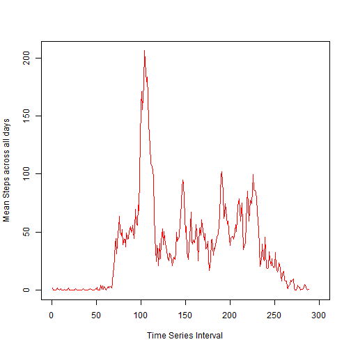
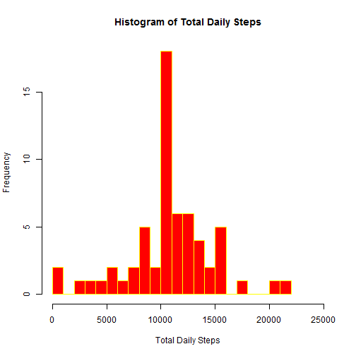
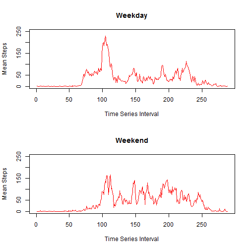

---
<<<<<<< HEAD
title: "Reproducible Research- P. A. 1- Analysis of Times Series Measurements of Human Activity (Steps Taken)"
author: "Rory Quinn"
date: "Friday, September 11, 2015"
output: html_document
---

This is an analysis of human activity, specifically steps taken, collected by a personal activity monitoring device in 5 minute intervals over a 2 month period. The data was collected during October and November 2012. 

This analysis was carried out for Peer Assessment 1 of the Reproducible Research course on Coursera. Data available here - [Download Activity Monitoring Data](https://d396qusza40orc.cloudfront.net/repdata%2Fdata%2Factivity.zip) 

###Loading and Preprocessing the Data


```r
activity <- read.csv ("./data/activity.csv", header=TRUE, stringsAsFactors=FALSE)
```

###What is Mean Total Number of Steps Taken Per Day

For this part of the assignment we are asked to ignore missing values....  

**1. Calculate the total number of steps taken per day**


```r
activity_1 <- na.omit (activity)
total_daily <- tapply (activity_1$steps, activity_1$date, sum)
total_daily
```

```
## 2012-10-02 2012-10-03 2012-10-04 2012-10-05 2012-10-06 2012-10-07 
##        126      11352      12116      13294      15420      11015 
## 2012-10-09 2012-10-10 2012-10-11 2012-10-12 2012-10-13 2012-10-14 
##      12811       9900      10304      17382      12426      15098 
## 2012-10-15 2012-10-16 2012-10-17 2012-10-18 2012-10-19 2012-10-20 
##      10139      15084      13452      10056      11829      10395 
## 2012-10-21 2012-10-22 2012-10-23 2012-10-24 2012-10-25 2012-10-26 
##       8821      13460       8918       8355       2492       6778 
## 2012-10-27 2012-10-28 2012-10-29 2012-10-30 2012-10-31 2012-11-02 
##      10119      11458       5018       9819      15414      10600 
## 2012-11-03 2012-11-05 2012-11-06 2012-11-07 2012-11-08 2012-11-11 
##      10571      10439       8334      12883       3219      12608 
## 2012-11-12 2012-11-13 2012-11-15 2012-11-16 2012-11-17 2012-11-18 
##      10765       7336         41       5441      14339      15110 
## 2012-11-19 2012-11-20 2012-11-21 2012-11-22 2012-11-23 2012-11-24 
##       8841       4472      12787      20427      21194      14478 
## 2012-11-25 2012-11-26 2012-11-27 2012-11-28 2012-11-29 
##      11834      11162      13646      10183       7047
```

**2.Make a histogram of the total number of steps taken each day**


```r
hist (total_daily, 20, col="red", border= "yellow", main="Histogram of Total Daily Steps", xlab="Total Daily Steps", xlim=c(0,25000))
```

 

**3. Calculate and Report the Mean and Median of the total steps taken per day**


```r
mean_total_daily <- mean (total_daily)
mean_total_daily <- as.integer (mean_total_daily)
median_total_daily <- median (total_daily)
median_total_daily <- as.integer(median_total_daily)
```

The mean of the total steps taken per day is 10766. The median of the total steps taken per day is 10765.

###What is the average Daily Activity pattern

**1. Make a time series plot of the 5 minute interval and the average number of steps taken averaged across all days**


```r
mean_daily <- tapply (activity_1$steps, activity_1$interval,mean)
plot (mean_daily, type="l", col="red", xlab="Time Series Interval", xlim=c(0,300), ylab="Mean Steps across all days")
```

 

**2. Which 5 minute interval across all the days in the dataset contains the maximum number of steps**


```r
which.max(mean_daily)
```

```
## 835 
## 104
```

The 5 minute interval that contains the maximum number of steps across all the days is the  104th interval which is the interval between 8.35am and 8.40am

###Inputting missing values

**1. Calculate and report the total number of missing values in the dataset**


```r
missing_values <- is.na(activity)
missing_values <- sum(missing_values)
```

The total number of missing values in the dataset is 2304.

**2. Devise a strategy for filling in missing rows in the dataset.** 

In order to fill the missing rows of the dataset I replaced na's with the mean number of steps taken for that 5 minute interval averaged across all the days for which there was data. 

First I aggregated the data with nas omitted to return a data frame with mean number of steps taken per 5 minute interval. I then replaced the na s in the original dataset with mean values from the aggregated data frame for the same 5 minute intervals. 

**3. Create a new datset that is equal to the original dataset but with the missing data filled in** 


```r
mean_daily_1 <- aggregate (activity_1$steps ~ activity_1$interval, FUN=mean)
names (mean_daily_1) <- c("interval", "steps")
 activity$steps[is.na(activity$steps)] <- mean_daily_1$steps[match(activity$interval[is.na(activity$steps)],mean_daily_1$interval)]
head (activity)
```

```
##       steps       date interval
## 1 1.7169811 2012-10-01        0
## 2 0.3396226 2012-10-01        5
## 3 0.1320755 2012-10-01       10
## 4 0.1509434 2012-10-01       15
## 5 0.0754717 2012-10-01       20
## 6 2.0943396 2012-10-01       25
```

**4. Make a histogram of the total number of steps taken each day and Calculate and report the mean and median total number of steps taken per day. Do these values differ from the estimates from the first part of the assignment? What is the impact of inputting missing data on the estimates of the total daily number of steps?**


```r
fulltotal_daily <- tapply (activity$steps, activity$date, sum)
hist (fulltotal_daily, 20, col="red", border= "yellow", main="Histogram of Total Daily Steps", xlab="Total Daily Steps", xlim=c(0,25000))
```

 


```r
mean_total_daily <- mean (fulltotal_daily)
mean_total_daily <- as.integer (mean_total_daily)
median_total_daily <- median (fulltotal_daily)
median_total_daily <- as.integer (median_total_daily)
```

The mean of the total steps taken per day (having replaced na s) is 10766. The median of the total steps taken per day is 10766. 

###Are there differences in activity patterns between weekdays and weekends?

**1.Create a new factor variable in the dataset with two levels - weekday and weekend indicating whether a given date is a weekday or weekend day.**


```r
activity$date <- as.Date(activity$date)
days_week <- c("Monday", "Tuesday", "Wednesday", "Thursday", "Friday")
activity$day <- factor ((weekdays(activity$date) %in% days_week), levels=c(FALSE, TRUE), labels=c("weekend", "weekday"))
```

**2.Make a panel plot containing a time series plot (i.e. type = "l") of the 5-minute interval (x-axis) and the average number of steps taken, averaged across all weekday days or weekend days (y-axis).**


```r
split_activity <- split (activity, activity$day)
wd_split_activity <- tapply (split_activity$weekday$steps, split_activity$weekday$interval, mean)
we_split_activity <- tapply (split_activity$weekend$steps, split_activity$weekend$interval, mean)
par (mfrow=c(2,1))
plot (wd_split_activity, type="l", col="red", xlab="Time Series Interval", ylab= "Mean Steps", main="Weekday", ylim=c(0,250))
plot (we_split_activity, type="l", col="red", xlab="Time Series Interval",  ylab= "Mean Steps", main="Weekend", ylim=c(0,250))
```

 


>>>>>>> 80edf39c3bb508fee88e3394542f967dd3fd3270
